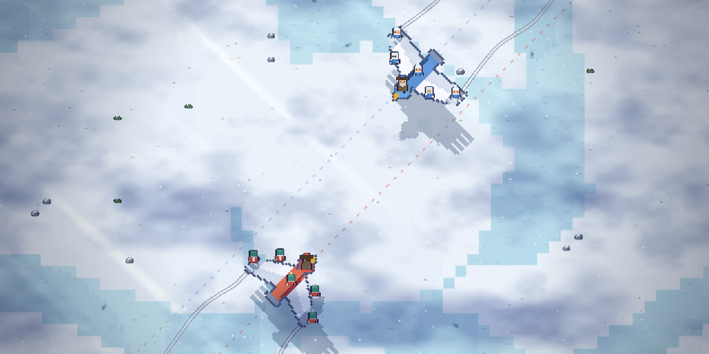
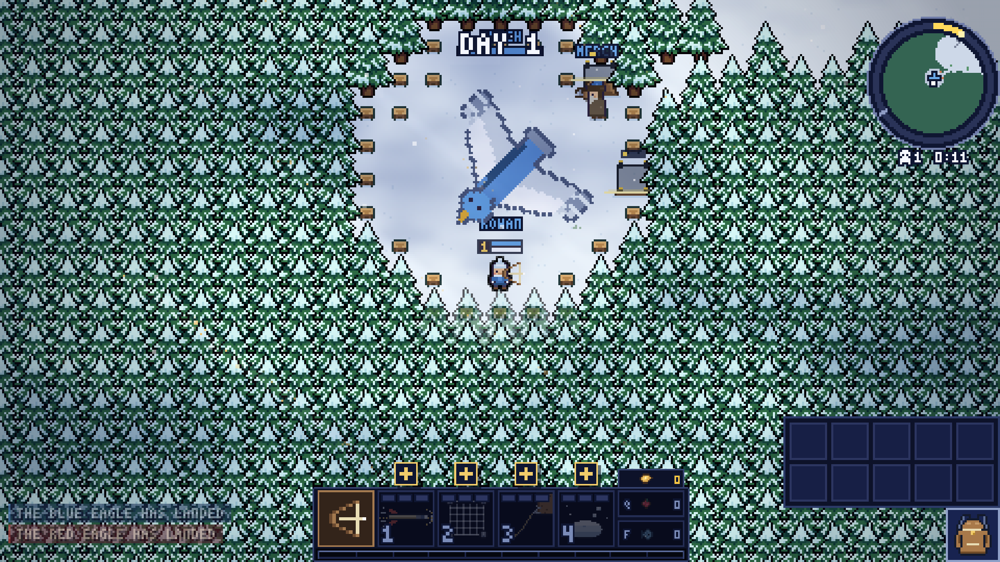
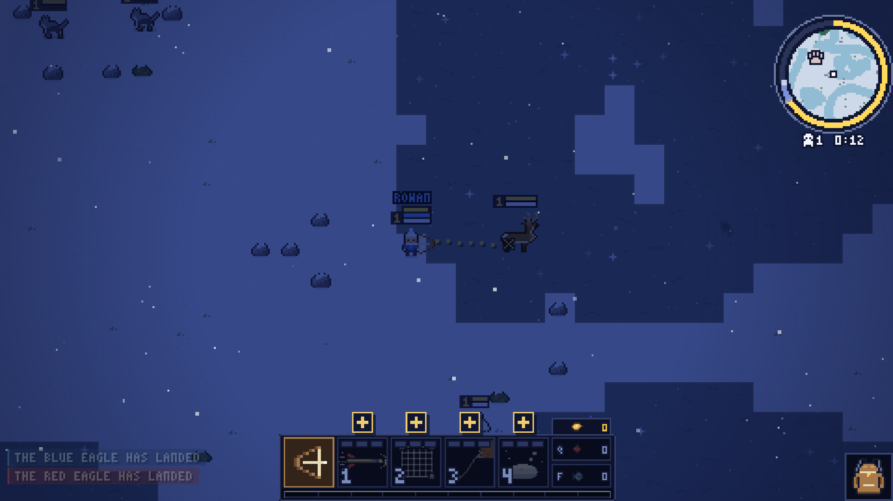
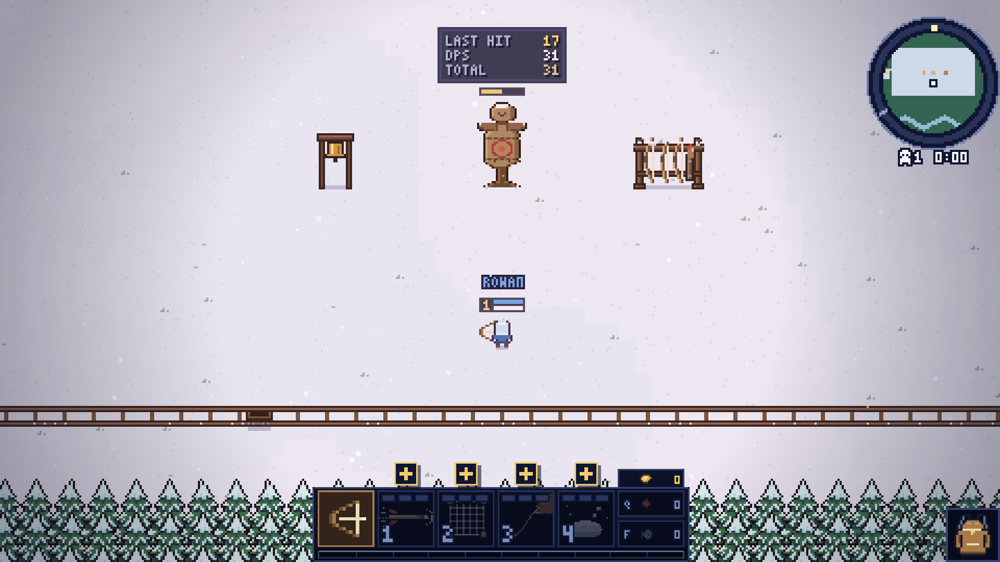
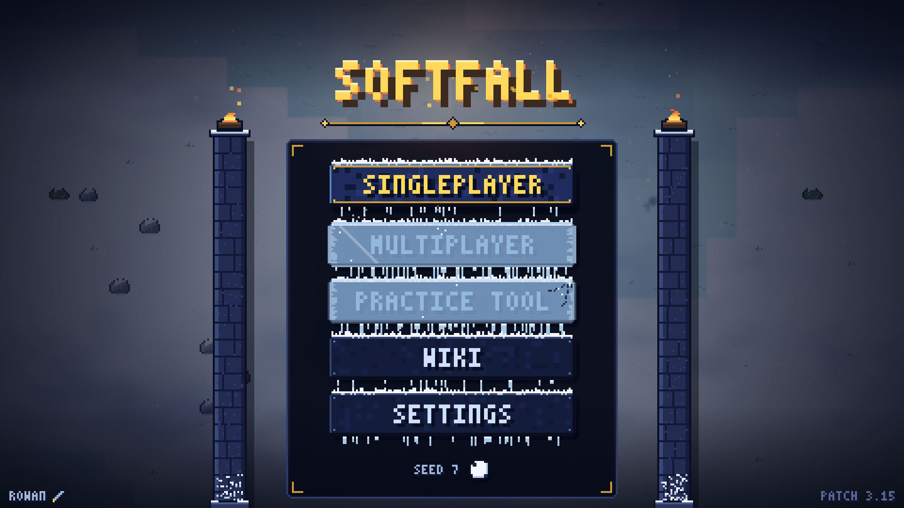

# Softfall

**Genre:** Action, Indie

**Short description:** Softfall is a cozy pixel-art survival team battle on a snowbound map. Ten scouts drop in by eagle, two teams of five, then hunt, chop, bury themselves in the drift and fight for the birds that carried them in: drive off the rival eagle and the match is won. Go down and you come back at your own.

**Tags:** Survival, Pixel Art, Cozy, Team-Based, Top-Down, PvP, Multiplayer, Base Building, Hunting, Winter, Roguelike, Action, 2D, Indie

<p align="center">
  <a href="https://discord.gg/xE5wzvz9zK">Discord</a>
  &nbsp;·&nbsp;
  <a href="https://www.youtube.com/@SoftfallYT">YouTube</a>
  &nbsp;·&nbsp;
  <a href="mailto:softfallbusiness@gmail.com">softfallbusiness@gmail.com</a>
</p>

<p align="center">
  
</p>

## A match

Ten players — **you, and nine AI** — across two teams. Everyone is carried in by their team's armoured eagle. The birds fly the map's one diagonal in opposite directions, pass in the middle, and dive into opposite corners of the treeline. Where yours lands is your roost, your merchant, your way back from a death, and the only thing that ends the match.

<p align="center">
  
</p>

Go down and you wait, then land back at your own bird. Kills never win a match. **The eagle does.**

## The loops

<p align="center">
  
</p>

**The draw is the ammunition.** There is no quiver. How long you hold the string is how far, how fast and how hard the shot lands. Deer wander the clearings, rabbits are white on white until they bolt, and the wolves come from one den marked on your map.

**Your weapon is something you build.** A tool is a body with a rate of fire and a few cells. What comes out of it is the bits you load: a plain arrow, a log that arcs down, a wisp that lights the dark, or a modifier that rewrites every shot. All of it is found in rocks, pines and treeline chests, or bought off the merchant's rotating counter — never a loadout you picked in a menu.

<p align="center">
  
</p>

**Gold is the only currency, and gold is also XP.** Fish and berries have a price that moves all day. One backpack, four class keys, gear bought from anywhere, worker bots on a planted flag, and a roll that is a hit.

**Every scout is a HUNTER or a WARRIOR.** Piercing shot, net, grapple, snow cover. Shield, rush, stomp, juggernaut. Four keys, each with a cast the body visibly performs.

<p align="center">
  
</p>

**Learn the string before the match.** Knock the ice off the practice plank on the title screen. A dummy, a scored archery round, a timed ice-parkour loop. Nothing in it counts.

<p align="center">
  
</p>

## Why it is on GitHub

- **Runs from a double-click.** `index.html` loads a handful of classic scripts. There is no bundler, no `node_modules`, and nothing that has to be served — a `file://` page is how the game is meant to be played.
- **HTML5 canvas pixel art**, 2D top-down, one winter world per seed. Share a seed number, get the same map.
- **Single-player today:** two teams of five, your four team-mates and the five rivals played by AI at Normal, Hard or Impossible. Keyboard, gamepad, or a phone's twin-stick touch.
- **The whole arsenal is unlocked from the first match.** A wiki on the menu writes every tool and bit down with its numbers.

```
git clone https://github.com/Aptyll/SmallScope.git
# then double-click index.html
# or:
node app/server.js
```

## Key features

- Ten-player team battles, five a side, on a seeded winter map
- One objective: drive off the rival eagle
- A bow with no ammo — the draw is the throttle
- Tools and bits found on the map: a weapon you assemble mid-fight
- Two classes, four abilities, gear in four pieces
- Worker bots, walls, turrets, fish nets, roguelike cards from chests
- Momentum movement: slippery ice, chained dodges, a roll that hits
- Day and night, wind in every pine, cozy and a war at once

## Coming soon on Steam

Wishlist when the store page lands. Windows release, price to be announced. The game you clone here is the game that will ship.

| | |
| --- | --- |
| **Release** | Coming soon |
| **Platform** | Windows, and this browser build |
| **Players** | Single-player vs AI, two teams of five |
| **Developer** | Softfall |
| **Support** | softfallbusiness@gmail.com |
| **Languages** | English |

## License

The **source code** is [MIT](LICENSE). **Art, audio, and the Softfall name** are all rights reserved. That includes the pixel art in `js/sprites.js`, the baked clips in `js/sfxdata.js`, and the files under `audio/` and `docs/media/` — even though some of that lives in `.js` files.

## Contributing

Run `sh scripts/setup-hooks.sh` once after cloning.
